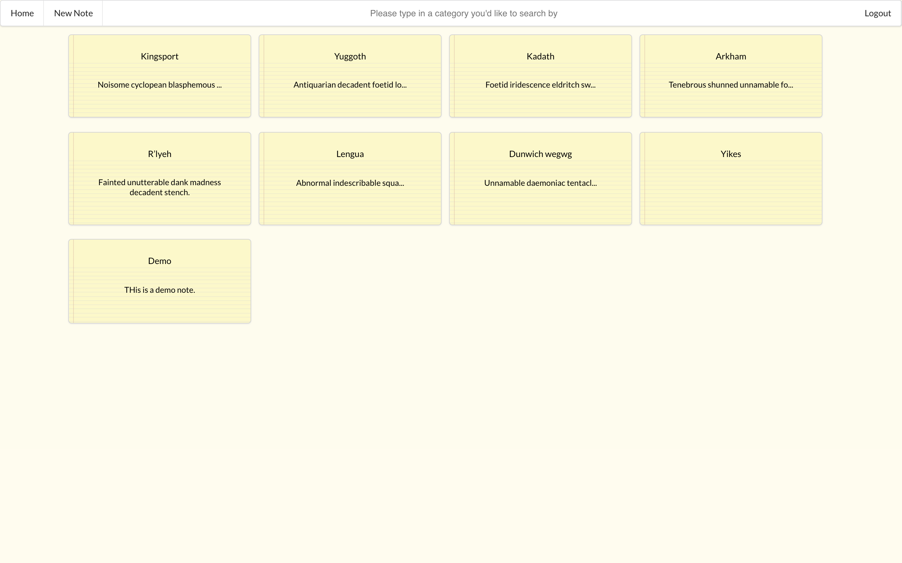
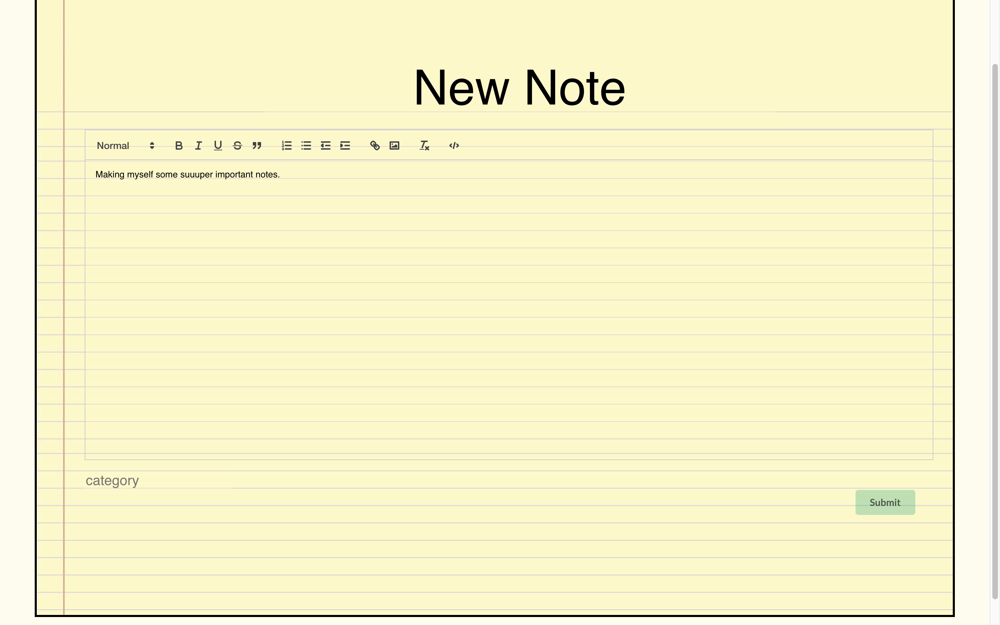

# DulyNoted

________________________________________________________

## To install 
1. Open your terminal.
2. Git clone git@github.com:AnansiOmega/DulyNotedFrontEnd.git
3. Cd into noteprojectfrontend (case sensitive)
4. Open with code .
6. Run npm i && npm start
7. Make sure to have the DulyNotedBackend setup as well.(git@github.com:AnansiOmega/DulyNotedBackend.git)
8. Make a profile and start taking notes!

________________________________________________________

## Getting started 
**1. Signup with a Username**

**2. Once Logged in, you will be redirected to the page that houses all of the notes**

**3. You can create new notes and they will be added to your homepage of all of the notes.**

**4. The rest of the Application has intuitive CRUD for anything the user would want to do. I also included a search functionality to search through all of the notes, by searching by category.**
________________________________________________________
